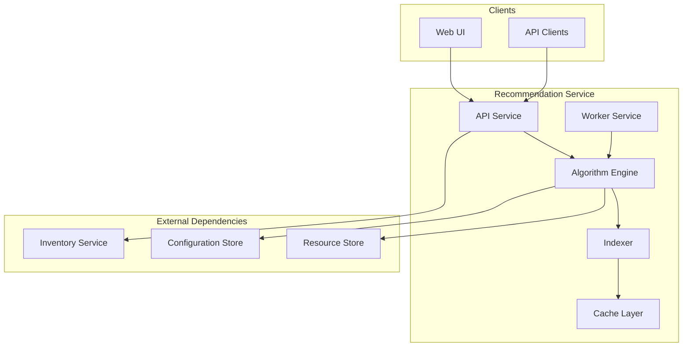

# 📖 BookVerse Recommendations Service - Complete Guide

## 📋 Table of Contents

- [Service Overview](#service-overview)
- [Architecture](#architecture)
- [API Reference](#api-reference)
- [Algorithm](#algorithm)
- [Configuration](#configuration)
- [Local Development](#local-development)
- [Deployment](#deployment)
- [Monitoring](#monitoring)

## 🎯 Service Overview

### Purpose
The BookVerse Recommendations Service is an AI-powered recommendation engine that provides personalized book suggestions to users based on their reading history, preferences, and behavioral patterns. The service is designed to showcase enterprise-grade software delivery practices while maintaining simplicity for demonstration purposes.

### Key Features
- **Real-time Recommendations** - Sub-200ms response times for personalized suggestions
- **Scalable Architecture** - Independent scaling of API and worker components
- **Configurable Algorithms** - External configuration for easy tuning without code changes
- **Comprehensive Monitoring** - Full observability with health checks and metrics
- **Security First** - OIDC authentication and evidence-based compliance

### Artifacts Produced
1. **📱 API Service** - Main recommendation service (Docker image)
2. **🔧 Worker Service** - Background processing engine (Docker image)  
3. **⚙️ Configuration Bundle** - Algorithm parameters and settings (Generic artifact)
4. **📚 Resources Bundle** - ML models, stopwords, and training data (Generic artifact)

## 🏗️ Architecture

### System Components



### Data Flow
1. **Indexing**: Worker service fetches book and transaction data from Inventory service
2. **Processing**: Algorithm engine builds inverted indices for genres and authors
3. **Caching**: Frequently accessed recommendations are cached with configurable TTL
4. **Serving**: API service responds to recommendation requests using cached and computed results

## 🔗 API Reference

### Core Endpoints
| Method | Endpoint | Description | Response Time |
|--------|----------|-------------|---------------|
| `GET` | `/health` | Basic health check | <10ms |
| `GET` | `/info` | Service information and version | <50ms |
| `GET` | `/api/v1/recommendations/health` | Detailed health diagnostics | <100ms |

### Recommendation Endpoints
| Method | Endpoint | Description | Response Time |
|--------|----------|-------------|---------------|
| `GET` | `/api/v1/recommendations/similar?book_id=<uuid>&limit=10` | Books similar to specified book | <200ms |
| `POST` | `/api/v1/recommendations/personalized` | Personalized recommendations based on user profile | <300ms |
| `GET` | `/api/v1/recommendations/trending?limit=10` | Currently trending books | <150ms |

### Example Requests

#### Get Similar Books
```bash
curl "http://localhost:8000/api/v1/recommendations/similar?book_id=123e4567-e89b-12d3-a456-426614174000&limit=5"
```

**Response**:
```json
{
  "recommendations": [
    {
      "book_id": "456e7890-e89b-12d3-a456-426614174001",
      "title": "The Great Adventure",
      "author": "Jane Doe",
      "score": 0.85,
      "reason": "Similar genre and author style"
    }
  ],
  "total": 1,
  "processing_time_ms": 120
}
```

#### Get Personalized Recommendations
```bash
curl -X POST "http://localhost:8000/api/v1/recommendations/personalized" \
  -H "Content-Type: application/json" \
  -d '{
    "user_id": "user123",
    "preferences": {
      "genres": ["fiction", "mystery"],
      "authors": ["Agatha Christie"]
    },
    "limit": 10
  }'
```

#### Get Trending Books
```bash
curl "http://localhost:8000/api/v1/recommendations/trending?limit=10"
```

## 🧮 Algorithm

### Recommendation Algorithm

The service uses a sophisticated rule-based scoring system that balances multiple factors:

#### Scoring Formula
```
Score = (1.0 × genre_overlap) + (0.25 × author_overlap) + (0.10 × popularity_factor)
```

#### Components

1. **Genre Overlap** (Weight: 1.0)
   - Jaccard similarity between book genres
   - Primary factor for content-based recommendations

2. **Author Overlap** (Weight: 0.25)
   - Boolean match for same author
   - Promotes books by authors users already enjoy

3. **Popularity Factor** (Weight: 0.10)
   - Derived from recent stock_out transactions
   - Normalized to 0-1 range
   - Provides trending boost to recommendations

#### Process Flow

1. **Candidate Generation**
   - Extract genres and authors from seed book/user preferences
   - Query inverted indices for books sharing these attributes
   - Fallback to trending books if no matches found

2. **Scoring**
   - Calculate overlap scores for each candidate
   - Apply weighting formula
   - Filter out low-scoring results (configurable threshold)

3. **Ranking & Filtering**
   - Sort by final score (descending)
   - Apply availability filters if configured
   - Limit results to requested count

#### Configuration Parameters

```yaml
# config/recommendations-settings.yaml
algorithm:
  weights:
    genre_similarity: 0.4      # Genre overlap importance
    author_similarity: 0.3     # Author match importance
    popularity_boost: 0.2      # Trending factor importance
    recency_factor: 0.1        # Recent release boost
  thresholds:
    min_similarity: 0.1        # Minimum score to include
    max_recommendations: 50    # Maximum results to process
  filters:
    exclude_out_of_stock: true # Filter unavailable books
    exclude_adult_content: false # Content filtering
```

## ⚙️ Configuration

### Environment Variables

| Variable | Description | Default | Required |
|----------|-------------|---------|----------|
| `INVENTORY_BASE_URL` | Base URL for inventory service | `http://inventory:8000` | Yes |
| `RECOMMENDATIONS_SETTINGS_PATH` | Path to YAML settings file | `config/recommendations-settings.yaml` | No |
| `RECO_TTL_SECONDS` | Cache TTL override | From config file | No |
| `LOG_LEVEL` | Logging level | `INFO` | No |
| `WORKERS` | Number of worker processes | `1` | No |

### Configuration Files

#### Algorithm Settings
**Path**: `config/recommendations-settings.yaml`

```yaml
algorithm:
  weights:
    genre_similarity: 0.4
    author_similarity: 0.3
    popularity_boost: 0.2
    recency_factor: 0.1
  thresholds:
    min_similarity: 0.1
    max_recommendations: 50
  filters:
    exclude_out_of_stock: true
    exclude_adult_content: false

cache:
  ttl_seconds: 3600          # 1 hour cache
  max_entries: 10000         # Maximum cached items
  enabled: true

indexing:
  rebuild_interval: 3600     # Rebuild indices every hour
  batch_size: 1000          # Books to process per batch
  concurrent_workers: 2      # Parallel indexing workers

logging:
  level: INFO
  format: structured
  include_request_id: true
```

#### Resources
**Path**: `resources/stopwords.txt`
```
a
an
and
are
as
at
be
been
by
for
from
has
he
in
is
it
its
of
on
that
the
to
was
were
will
with
```

## 🛠️ Local Development

### Prerequisites
- Python 3.11+
- Docker (optional, for containerized development)
- Access to BookVerse Inventory service

### Setup

```bash
# Clone repository
git clone https://github.com/bookverse/bookverse-recommendations.git
cd bookverse-recommendations

# Create virtual environment
python -m venv venv
source venv/bin/activate  # On Windows: venv\Scripts\activate

# Install dependencies
pip install -r requirements.txt

# Install development dependencies
pip install -r requirements-dev.txt
```

### Running the Service

#### API Service
```bash
# Development mode with auto-reload
uvicorn app.main:app --reload --port 8000

# Production mode
uvicorn app.main:app --host 0.0.0.0 --port 8000 --workers 4
```

#### Worker Service
```bash
# Background worker
python -m app.worker

# Worker with debugging
python -m app.worker --log-level DEBUG
```

#### Docker Development
```bash
# Build images
docker build -t bookverse-recommendations:dev .
docker build -f Dockerfile.worker -t bookverse-recommendations-worker:dev .

# Run with docker-compose
docker-compose up -d

# View logs
docker-compose logs -f recommendations
```

### Testing

```bash
# Run all tests
pytest

# Run with coverage
pytest --cov=app --cov-report=html

# Run specific test file
pytest tests/test_algorithms.py -v

# Run performance tests
pytest tests/test_performance.py --benchmark-only
```

### Code Quality

```bash
# Format code
black app/ tests/
isort app/ tests/

# Lint code
flake8 app/ tests/
mypy app/

# Security scan
bandit -r app/
```

## 🚀 Deployment

### Kubernetes Deployment

The service is deployed as part of the BookVerse platform using Helm charts.

#### Helm Chart Structure
```
bookverse-helm/charts/platform/
├── templates/
│   ├── recommendations-api.yaml
│   ├── recommendations-worker.yaml
│   ├── recommendations-config.yaml
│   └── recommendations-service.yaml
└── values.yaml
```

#### Configuration
**Path**: `values.yaml`
```yaml
recommendations:
  api:
    enabled: true
    image:
      repository: apptrusttraining1.jfrog.io/bookverse-recommendations-prod-docker-local
      tag: "1.2.3"
    replicas: 3
    resources:
      requests:
        cpu: 100m
        memory: 256Mi
      limits:
        cpu: 500m
        memory: 512Mi
  
  worker:
    enabled: true
    image:
      repository: apptrusttraining1.jfrog.io/bookverse-recommendations-prod-docker-local
      tag: "1.2.4"
    replicas: 1
    resources:
      requests:
        cpu: 200m
        memory: 512Mi
      limits:
        cpu: 1000m
        memory: 1Gi

  config:
    algorithm:
      weights:
        genre_similarity: 0.4
        author_similarity: 0.3
        popularity_boost: 0.2
    cache:
      ttl_seconds: 3600
      max_entries: 50000
```

#### Deployment Commands
```bash
# Install/upgrade the platform
helm upgrade --install bookverse-platform charts/platform/ \
  --namespace bookverse \
  --values values-prod.yaml

# Check deployment status
kubectl get pods -n bookverse -l app=recommendations

# View logs
kubectl logs -n bookverse -l app=recommendations-api -f
```

### Environment-Specific Configuration

#### Development
- Single replica for API and worker
- Debug logging enabled
- Shorter cache TTL for testing
- Mock data sources

#### Staging
- Multi-replica setup
- Production-like configuration
- Full monitoring and alerting
- Real data sources

#### Production
- High availability setup (3+ replicas)
- Resource limits and requests
- Full observability stack
- Performance optimization

## 📊 Monitoring

### Health Checks

#### API Health Check
```bash
curl http://localhost:8000/health
```

**Response**:
```json
{
  "status": "healthy",
  "timestamp": "2024-01-15T10:30:00Z",
  "version": "1.2.3"
}
```

#### Detailed Diagnostics
```bash
curl http://localhost:8000/api/v1/recommendations/health
```

**Response**:
```json
{
  "status": "healthy",
  "checks": {
    "database": "healthy",
    "inventory_service": "healthy",
    "cache": "healthy",
    "worker": "healthy"
  },
  "metrics": {
    "total_requests": 12345,
    "avg_response_time": 120,
    "cache_hit_rate": 0.85,
    "error_rate": 0.001
  },
  "version": "1.2.3",
  "uptime_seconds": 86400
}
```

### Metrics Collection

#### Prometheus Metrics
- `recommendations_requests_total` - Total API requests
- `recommendations_request_duration_seconds` - Request duration histogram
- `recommendations_cache_hits_total` - Cache hit counter
- `recommendations_errors_total` - Error counter by type
- `recommendations_index_size` - Current index size
- `recommendations_worker_tasks_total` - Worker task counter

#### Custom Metrics
```python
# Example metrics collection
from prometheus_client import Counter, Histogram, Gauge

request_count = Counter('recommendations_requests_total', 'Total requests', ['method', 'endpoint'])
request_duration = Histogram('recommendations_request_duration_seconds', 'Request duration')
cache_hits = Counter('recommendations_cache_hits_total', 'Cache hits')
index_size = Gauge('recommendations_index_size', 'Current index size')
```

### Logging

#### Log Format
```json
{
  "timestamp": "2024-01-15T10:30:00Z",
  "level": "INFO",
  "logger": "recommendations.api",
  "message": "Recommendation request processed",
  "request_id": "req-12345",
  "user_id": "user-789",
  "book_id": "book-456",
  "response_time_ms": 120,
  "recommendations_count": 10
}
```

#### Log Levels
- `DEBUG` - Detailed algorithm execution
- `INFO` - Request/response lifecycle
- `WARNING` - Performance degradation
- `ERROR` - Service errors and failures
- `CRITICAL` - Service unavailability

### Alerting

#### Alert Rules
```yaml
# High error rate
- alert: RecommendationsHighErrorRate
  expr: rate(recommendations_errors_total[5m]) > 0.01
  labels:
    severity: warning
  annotations:
    summary: "High error rate in recommendations service"

# Slow response time
- alert: RecommendationsSlowResponse
  expr: histogram_quantile(0.95, recommendations_request_duration_seconds) > 0.5
  labels:
    severity: warning
  annotations:
    summary: "Slow response times in recommendations service"

# Service down
- alert: RecommendationsServiceDown
  expr: up{job="recommendations"} == 0
  labels:
    severity: critical
  annotations:
    summary: "Recommendations service is down"
```

---

## 📚 Additional Resources

- [CI/CD Architecture](./CI_CD_ARCHITECTURE.md) - Complete CI/CD system architecture
- [Workflow Reference](./WORKFLOW_REFERENCE.md) - Detailed workflow documentation
- [Troubleshooting Guide](./TROUBLESHOOTING.md) - Common issues and solutions
- [Main README](../README.md) - Quick start and overview

---

*Last Updated: 2024-01-15*
*Document Version: 1.0.0*
*Maintained by: BookVerse Development Team*
